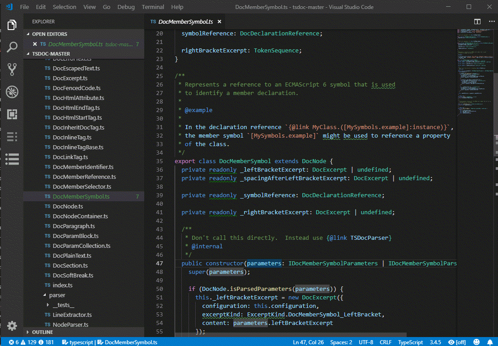
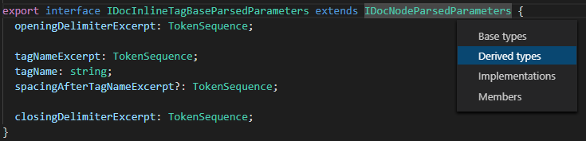
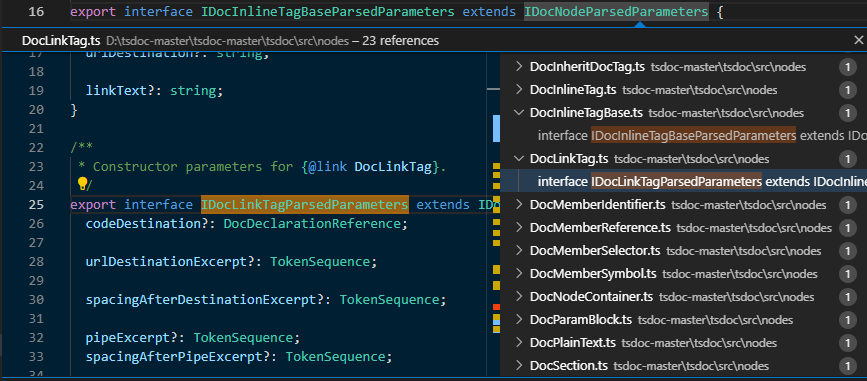
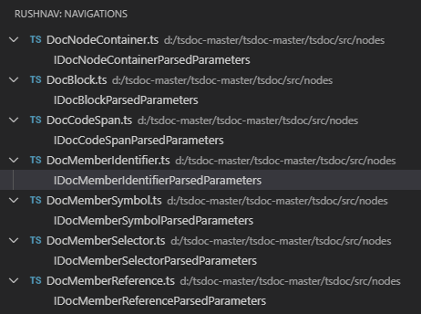

Navigate to a TypeScript type declaration

# TypeScript Type Navigation

The CodeRush extension allows you to easily navigate to: 

*   Base Types
*   Derived Types
*   Members
*   Instantiations
*   Implementations

## Installation

Use the **code --install-extension navigation-0.0.2.vsix** command.

## How to Use

* Place the caret in a type name and press the **Ctrl** + **Alt** + **N** or **Ctrl** + **Alt** + **P** shortcut.

The navigation menu appears.

* Choose the required type you want to jump to and press **Enter**.

If you used the **Ctrl** + **Alt** + **P** shortcut, CodeRush shows the navigation results in the Visual code editor's new window.

If you used the **Ctrl** + **Alt** + **N** shortcut, CodeRush shows the found types in the CodeRush navigation tree.

* Select a required type in the navigation results to jump to a type declaration.
