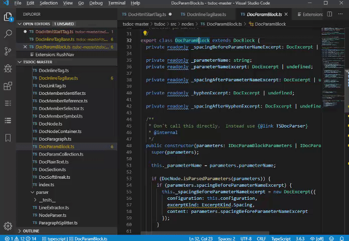
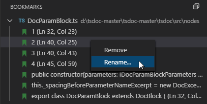
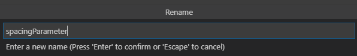
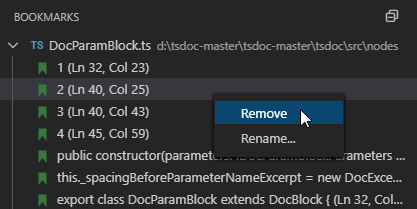
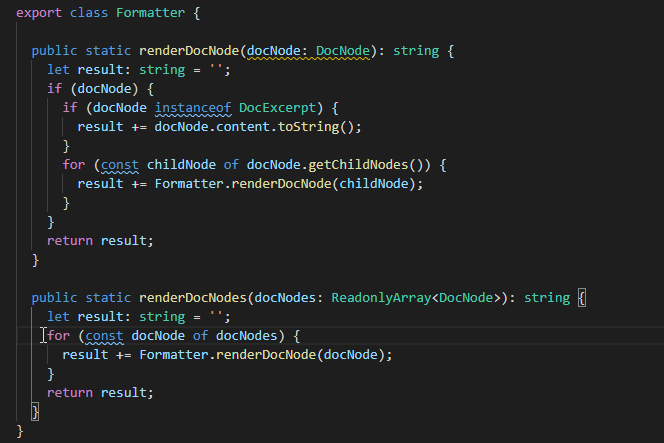
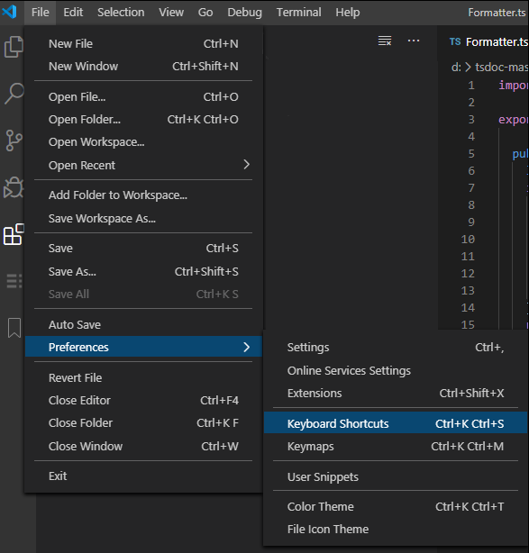
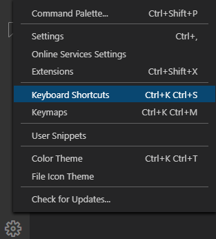
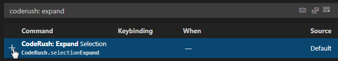
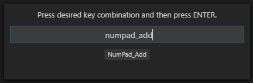

# RushNav

Navigate to TypeScript type declarations and references. Quickly expand or reduce the selected text by logical code blocks (in TypeScript and JavaScript).
Use bookmarks and markers in TypeScript to mark important parts of your code, and instantly return to these parts at any time.

## TypeScript Type Navigation 

This CodeRush extension helps you quickly and easily navigate to: 

*   Base Types
*   Derived Types
*   Implementations
*   Instantiations
*   Members

### Easy to Use

*   Place the caret in a type name and press **Ctrl + Alt + P**.

The navigation menu appears…

*  Choose the type you want to jump to and press **Enter**. Types will appear in the VS Code Peek window.
 

 
If you prefer to see the types in a side Navigation panel (instead of the Peek window):

Use **Ctrl + Alt +N** to invoke **RushNav** navigation menu, select the kinds of places you want to navigate to and press **Enter**.

Types will appear in the navigation tree. 

## Bookmarks

CodeRush provides both **numbered** and **anonymous** bookmarks which you can use to mark important locations in the code and return to them at any time.

### Dropping Bookmarks

To drop numbered bookmarks: place the caret at any position in the code editor and press one of the following shortcuts:

* **Ctrl**+**Alt**+**Shift**+**1**
* **Ctrl**+**Alt**+**Shift**+**2**
* **Ctrl**+**Alt**+**Shift**+**3**
* **Ctrl**+**Alt**+**Shift**+**4**
* **Ctrl**+**Alt**+**Shift**+**5**
* **Ctrl**+**Alt**+**Shift**+**6**
* **Ctrl**+**Alt**+**Shift**+**7**
* **Ctrl**+**Alt**+**Shift**+**8**
* **Ctrl**+**Alt**+**Shift**+**9**

CodeRush will add the numbered bookmark, and you will be able to see it in both the **code editor** and the **BOOKMARKS** window.

Anonymous bookmarks can be dropped with **Ctrl**+**Alt**+**Num+** (num plus on the numeric keypad). 

CodeRush persists bookmarks across VS Code sessions. There is no limit to the number of bookmarks you can drop in a solution.

### Jumping to Bookmarks
To jump to a numbered bookmark from any location in the code, press any of the following shortcuts:

* **Ctrl**+**Alt**+**1**
* **Ctrl**+**Alt**+**2**
* **Ctrl**+**Alt**+**3**
* **Ctrl**+**Alt**+**4**
* **Ctrl**+**Alt**+**5**
* **Ctrl**+**Alt**+**6**
* **Ctrl**+**Alt**+**7**
* **Ctrl**+**Alt**+**8**
* **Ctrl**+**Alt**+**9**

You can also jump to numbered bookmarks by clicking the corresponding entry in the **Bookmarks** tab.

To navigate to an anonymous bookmark, click that desired bookmark entry in the **Bookmarks** tab.

### Editing Bookmarks

**To rename a bookmark**:

* Right-click a bookmark in the **BOOKMARKS** window and choose **Rename...** from the context menu:

  

* Enter the new name for the bookmark and press **Enter**:
   

 
   

**To remove a bookmark:**

* Select a bookmark in the code editor and press **Ctrl**+**Alt**+**Num-** (num minus on the numeric keypad)

or 

* Right-click the bookmark in the **BOOKMARKS** window and select **Remove** from the content menu.

## Markers

CodeRush markers are stack-based temporary bookmarks you can use to save and quickly traverse a trail of locations in the code.

**To drop a marker:**

* Select a section of code or place the caret anywhere in the code and press **Alt**+**Home** to drop a marker.

**To collect a marker:**
With caret inside the code editor (so it has focus):

* Press **Esc** to remove the marker from the stack, showing the selected code or previously-stored location. 

## Selection Expand/Reduce in TypeScript/JavaScript

The **Expand Selection** and **Reduce Selection** commands allow you to expand or reduce the selected text by logical code blocks. The **Expand Selection** command also selects the code block if the caret is inside it. 

You need to assign shortcuts before you can execute these commands.

## Add Shortcuts for Selection Expand/Reduce

1) Open the **Keyboard Shortcuts** editor:

*	Go to the **File** | **Preferences** | **Keyboard Shortcuts** menu item 

or 

* Сlick **Manage** and choose **Keyboard Shortcuts** item. 

2)	Find the **CodeRush: Expand Selection** command, select it, and click **Add Keybinding**.
    

3) In the dialog that appears, press the desired keyboard shortcut to bind to this command (for example, **NumPad_Add**) and press **Enter**. 
    

4)	Repeat these steps to bind a shortcut to the **CodeRush: Reduce Selection** command (for example, **NumPad_Subtract**).
